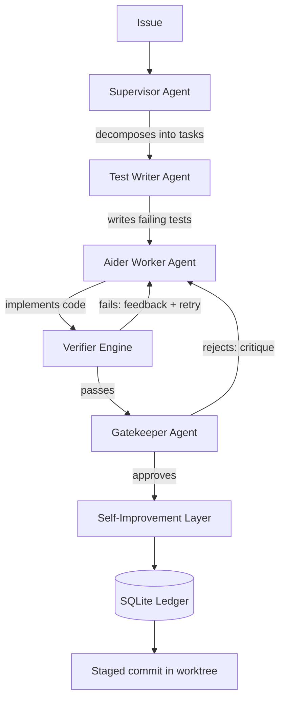

# GATE — Autonomous AI Development Pipeline

**GATE** (*Gate Analysis & Trust Engineering*) is an autonomous, agentic release controller for software engineering. It orchestrates a team of specialized AI agents that **plan → test → implement → verify → review** a change in complete isolation, and only stage it for merge once every gate passes.


---

## What it does

Give GATE an issue in plain English. It decomposes the work, writes failing tests first, implements the code with [Aider](https://aider.chat), proves it works in an isolated Docker sandbox, gets it reviewed by a gatekeeper agent, and — if anything fails — **self-repairs and retries** before proposing a clean, reviewable commit.

The whole run happens in an isolated **git worktree**, so your working branch is never touched.

## How it works



### The agent team

| Agent | Role |
|---|---|
| **Supervisor** | Explores the codebase (keyword + AST + optional semantic search) and decomposes the issue into atomic tasks. |
| **Test Writer** | TDD-first: writes failing tests before any implementation. |
| **Aider Worker** | Implements the feature in isolated, parallel git worktrees. |
| **Verifier** | *Deterministic* — runs `pytest` / `npm test` / builds inside Docker, with no LLM in the loop. |
| **Gatekeeper** | Senior-reviewer agent that searches the codebase to catch architecture breaks and downstream damage. |
| **Self-Improvement** | Mines failures, rewrites prompts, routes models, and proposes durable engineering rules. |
| **Ledger** | SQLite audit trail of every run, decision, and repair. |

## Quickstart

```bash
# 1. Clone
git clone https://github.com/osiddiki/ai-dev-pipeline.git
cd ai-dev-pipeline

# 2. Install dependencies
python3 -m venv .venv && source .venv/bin/activate
pip install -r requirements.txt

# 3. Configure (copy the template, add your model API key)
cp .env.example .env

# 4. Run against a target repo
python run_generator.py \
  --repo /path/to/your/repo \
  --issue-id "fix-auth-bug" \
  --description "Fix the authentication bug in the login flow."
```

## Requirements

- **Python 3.10+**
- **Docker** — the verifier runs commands in isolated containers
- **[aider-chat](https://aider.chat)** (`>=0.70`) — the code-editing engine
- A model API key — routing is handled through [LiteLLM](https://www.litellm.ai/) (defaults live in `agents/models.py`)

## Configuration

| Setting | Purpose |
|---|---|
| `.env` → `GEMINI_API_KEY` | API key for LiteLLM model calls |
| `.env` → `DATABASE_URL` | SQLite ledger path (defaults to `trust_ledger.db`) |
| `.env` → `SANDBOX_IMAGE` | Docker image for verification (defaults to `python:3.10-slim`) |
| `agents/models.py` | Runtime model-routing defaults |
| `metadata/<project>/gate.yml` | Per-project policy |

### Optional semantic search

GATE can use embeddings to help the Supervisor find relevant code:

```bash
GATE_RAG_PROVIDER=local      # default: local sentence-transformers
GATE_RAG_PROVIDER=disabled   # cheapest — keyword + AST search only
GATE_RAG_PROVIDER=api        # hosted embeddings via LiteLLM
```

## Trust model

The core idea: **Aider is trusted to attempt the code; GATE is trusted to decide whether it's acceptable.**

1. The **Test Writer** drafts failing tests.
2. **Aider** edits source to pass them.
3. The **deterministic Verifier** runs the real test suite — no model opinions.
4. Failures are classified and routed to prompt repair or model escalation.
5. The **Gatekeeper** reviews the verified diff with full codebase context.
6. Only then does GATE stage the exact files and commit a checkpoint.

## Project structure

```
agents/            # Supervisor, Test Writer, Worker, Gatekeeper, meta-analysis
orchestrator/      # pipeline, verifier, self-improvement loop
environment/       # MCP client, RAG, tools
mcp_servers/       # filesystem + bash MCP servers
integrations/      # Gemini (LiteLLM) client
ledger/            # SQLite audit trail
scripts/           # repo index + replay utilities
tests/             # unit tests
```

## Status

Experimental — built as a personal project to explore agentic development and self-repair loops. Contributions and feedback welcome.
